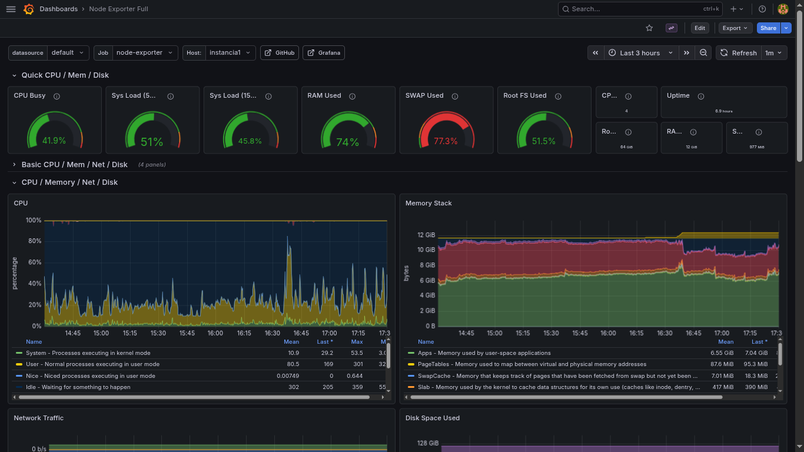

# 📡 Monitoring + SIEM Stack — Grafana + Prometheus + Zabbix + ELK

Stack completa de monitoramento, observabilidade e SIEM para redes locais e hosts remotos, construída com Docker Compose, deploy automatizado e integração com systemd.

| Componente | Função |
|-----------|------|
| **Node Exporter** | Métricas do sistema (CPU, memória, disco, rede) |
| **Prometheus** | Coleta e armazenamento de métricas (time-series) |
| **Grafana** | Visualização unificada (métricas, dados Zabbix, logs Elasticsearch) |
| **Zabbix Server** | Monitoramento de rede e hosts remotos (com/sem agente) |
| **Zabbix Web** | Interface de administração do Zabbix |
| **Zabbix Agent 2** | Monitoramento local do host + métricas Docker |
| **Elasticsearch** | Motor de busca, analytics e SIEM (single-node lab) |
| **Logstash** | Pipeline de ingestão de logs (Beats + Syslog) |
| **Kibana** | Interface de análise de logs, SIEM e detecção de ameaças |

---



---

## Funcionalidades

* Visualização completa de métricas do sistema via Grafana
* Monitoramento de CPU, memória, disco e rede com Node Exporter
* Monitoramento de rede local e hosts remotos com Zabbix (com e sem agente)
* Centralização de logs com ELK (Elasticsearch + Logstash + Kibana)
* Ingestão de logs via Beats (Filebeat, Winlogbeat) na porta 5044
* Ingestão de syslog de dispositivos de rede via porta 514 (TCP/UDP)
* SIEM com Kibana Security para detecção de ameaças
* Segurança TLS + autenticação habilitada no Elasticsearch
* Provisioning automático de dashboards e datasources no Grafana
* Deploy automatizado com serviço systemd para início no boot
* Armazenamento persistente com volumes Docker nomeados
* Limites de memória por container para proteção do host

---

## Arquitetura

```
┌──────────────────── Docker Compose (single host) ────────────────────┐
│                                                                       │
│  ┌── rede: monitoring ─────────────────────────────────────────────┐  │
│  │                                                                 │  │
│  │  ┌─────────────┐   scrape   ┌─────────────────┐                │  │
│  │  │Node Exporter├───────────►│   Prometheus     │                │  │
│  │  └─────────────┘            └────────┬────────┘                │  │
│  │                                      │                          │  │
│  │  ┌──────────────┐          ┌─────────┴────────┐                │  │
│  │  │ Zabbix Agent ├─────────►│  Zabbix Server   │                │  │
│  │  └──────────────┘          └──────┬───────────┘                │  │
│  │  ┌──────────────┐          ┌──────┴───────┐     ┌──────────┐  │  │
│  │  │  PostgreSQL  │◄─────────┤  Zabbix Web  │     │ Grafana  │  │  │
│  │  └──────────────┘          └──────────────┘     └────┬─────┘  │  │
│  │                                                      │  │      │  │
│  └──────────────────────────────────────────────────────│──│──────┘  │
│                                                         │  │         │
│  ┌── rede: elk ────────────────────────────────────────│──│───────┐  │
│  │                                                     │  │       │  │
│  │  Beats/Syslog ──► ┌───────────┐    ┌──────────────┐│  │       │  │
│  │   :5044 / :514    │ Logstash  ├───►│Elasticsearch ◄┘  │       │  │
│  │                   └───────────┘    └──────┬───────┘   │       │  │
│  │                                           │           │       │  │
│  │                                    ┌──────┴───────┐   │       │  │
│  │                                    │   Kibana     │   │       │  │
│  │                                    │   (SIEM)     │   │       │  │
│  │                                    └──────────────┘   │       │  │
│  └───────────────────────────────────────────────────────────────┘  │
│                                                                      │
└──────────────────────────────────────────────────────────────────────┘
```

---

## Requisitos

* Debian ou Ubuntu (testado em Debian 12+)
* **8 GB RAM mínimo** (12 GB+ recomendado com ELK completo)
* Privilégios sudo
* git, docker, docker-compose (v1 ou v2)
* openssl (para geração automática de senhas)
* `vm.max_map_count=262144` (necessário para Elasticsearch)

Para configurar o kernel para Elasticsearch:

```bash
sudo sysctl -w vm.max_map_count=262144
echo "vm.max_map_count=262144" | sudo tee -a /etc/sysctl.conf
```

---

## Instalação

```bash
sudo apt update && sudo apt install -y git docker.io docker-compose openssl
git clone https://github.com/MatheusFLB/monitoring-project.git
cd monitoring-project
chmod +x deploy.sh
sudo ./deploy.sh
```

O script irá:
* Verificar recursos disponíveis no sistema
* Solicitar senhas, portas e timezone interativamente
* Gerar certificados TLS para o ELK automaticamente
* Configurar senhas dos usuários `elastic` e `kibana_system`
* Criar diretórios persistentes com permissões corretas
* Iniciar todos os containers em ordem (ELK setup → base → Zabbix)
* Criar e habilitar serviço systemd para boot automático

---

## Pontos de Acesso

| Serviço | URL Padrão | Credenciais |
|---------|-------------|-------------|
| **Grafana** | `http://localhost:3000` | admin / *(definida no deploy)* |
| **Prometheus** | `http://localhost:9090` | — |
| **Zabbix Web** | `http://localhost:8080` | Admin / zabbix |
| **Kibana** | `http://localhost:5601` | elastic / *(definida no deploy)* |
| **Elasticsearch** | `https://localhost:9200` | elastic / *(definida no deploy)* |

> Altere as senhas padrão do Zabbix imediatamente após o primeiro login.

---

## Como Funciona

### Métricas (Prometheus + Node Exporter)
* **Node Exporter** exporta métricas de CPU, memória, disco e rede do host central
* **Prometheus** coleta métricas a cada 15 segundos e armazena com retenção de 30 dias
* Visualizado no Grafana via datasource Prometheus provisionado automaticamente

### Monitoramento de Rede e Hosts (Zabbix)
* **Zabbix Server** gerencia monitoramento de hosts locais e remotos
* **Zabbix Agent 2** roda no host central para métricas detalhadas + monitoramento Docker
* Hosts remotos podem ser monitorados com agente (checks ativos/passivos) ou sem agente (ICMP, TCP, SNMP)
* Dados do Zabbix são visualizados no Grafana via plugin Zabbix ou na interface nativa

### Logs e SIEM (ELK Stack)
* **Logstash** recebe logs de duas fontes:
  * **Beats** (porta 5044) — Filebeat, Winlogbeat, Auditbeat de hosts remotos
  * **Syslog** (porta 514 TCP/UDP) — roteadores, switches, firewalls, qualquer dispositivo de rede
* **Elasticsearch** indexa e armazena logs em índices diários (`logs-YYYY.MM.dd`)
  * Segurança habilitada: TLS entre todos os componentes + autenticação
  * Configurado como single-node para lab (comentários no compose explicam como escalar para cluster 3 nós)
* **Kibana** oferece interface completa para:
  * **Discover** — busca e análise de logs em tempo real
  * **Security** — SIEM com regras de detecção, timeline de investigação
  * **Dashboards** — visualizações e gráficos customizados
  * **Alerting** — notificações por email, Slack, webhook

### Limites de Memória

| Container | Limite |
|-----------|--------|
| Elasticsearch | 1.5 GB (heap: 512 MB) |
| Kibana | 1 GB |
| Logstash | 768 MB (heap: 256 MB) |
| Prometheus | 512 MB |
| Grafana | 512 MB |
| Zabbix DB | 512 MB |
| Zabbix Server | 512 MB |
| Zabbix Web | 256 MB |
| Node Exporter | 128 MB |
| Zabbix Agent | 128 MB |

---

## Enviando Logs para o Logstash

### Via Filebeat (hosts Linux/Windows)

Instale o Filebeat no host remoto e configure `filebeat.yml`:

```yaml
filebeat.inputs:
  - type: log
    paths:
      - /var/log/syslog
      - /var/log/auth.log

output.logstash:
  hosts: ["<IP_DO_SERVIDOR>:5044"]
  ssl.certificate_authorities: ["/path/to/ca.crt"]
```

Copie o arquivo `ca.crt` do volume `elk-certs` para o host remoto:

```bash
sudo docker cp elasticsearch:/usr/share/elasticsearch/config/certs/ca/ca.crt ./ca.crt
```

### Via Syslog (dispositivos de rede)

Configure o dispositivo para enviar syslog para `<IP_DO_SERVIDOR>:514` via TCP ou UDP. Exemplo para roteadores/switches:

```
logging host <IP_DO_SERVIDOR> transport udp port 514
```

---

## Adicionando Hosts Remotos ao Zabbix

### Com Zabbix Agent (recomendado para hosts gerenciados)

```bash
# Debian/Ubuntu
wget https://repo.zabbix.com/zabbix/7.0/ubuntu/pool/main/z/zabbix-release/zabbix-release_latest_7.0+ubuntu24.04_all.deb
sudo dpkg -i zabbix-release_latest_7.0+ubuntu24.04_all.deb
sudo apt update && sudo apt install -y zabbix-agent2
```

Configure `/etc/zabbix/zabbix_agent2.conf`:

```ini
Server=<IP_DO_HOST_MONITORAMENTO>
ServerActive=<IP_DO_HOST_MONITORAMENTO>
Hostname=<NOME_UNICO_DO_HOST>
```

```bash
sudo systemctl restart zabbix-agent2 && sudo systemctl enable zabbix-agent2
```

Adicione o host em **Zabbix Web → Data collection → Hosts → Create host**.

### Sem Agente (ICMP/TCP/SNMP)

Em **Zabbix Web → Data collection → Hosts → Create host**:
1. Defina o endereço IP do host
2. Vincule o template **ICMP Ping** (ou **Generic SNMP** para dispositivos SNMP)
3. O Zabbix Server executará os checks diretamente

---

## Escalando o Elasticsearch para Cluster

O `docker-compose.yml` contém comentários detalhados para migrar de single-node para cluster 3 nós. Resumo:

1. Remova `discovery.type=single-node`
2. Adicione 2 containers (`es02`, `es03`) com volumes dedicados
3. Configure `cluster.initial_master_nodes` e `discovery.seed_hosts`
4. Aumente `mem_limit` para 4 GB+ por nó e `ES_JAVA_OPTS` para `-Xms2g -Xmx2g`
5. Use um load balancer (nginx/haproxy) na frente dos nós

---

## Estrutura de Pastas

```
monitoring-project/
├── docker-compose.yml              # Orquestração de todos os serviços
├── deploy.sh                       # Script de deploy automatizado
├── .env                            # Senhas e portas (gerado pelo deploy.sh)
├── config/
│   ├── grafana/provisioning/       # Datasources, dashboards e alertas
│   ├── logstash/pipeline/          # Pipeline de ingestão (logstash.conf)
│   └── prometheus/                 # Configuração de scrape targets
├── data/                           # Volumes gerenciados pelo Docker
├── systemd/                        # Template do serviço systemd
└── assets/                         # Screenshots e imagens
```

---

## Notas de Segurança

* **Credenciais:**
  * `.env` contém todas as senhas — protegido com modo `600` e excluído do Git
  * Senha do banco Zabbix é gerada automaticamente com `openssl rand`
  * Elasticsearch usa TLS + senha para o usuário `elastic`
  * Altere a senha padrão do Zabbix Web (`Admin / zabbix`) após o primeiro login

* **Volumes persistentes contêm dados sensíveis:**
  * `data/grafana/` — usuários, hashes de senha, sessões
  * `data/zabbix-db/` — banco completo incluindo inventário de hosts
  * Volumes Docker do Elasticsearch — índices de logs com eventos do sistema

* **Portas expostas:**
  * Todos os serviços fazem bind em `0.0.0.0` por padrão — restrinja com firewall se exposto à internet
  * Porta 10051 do Zabbix Server deve ser acessível pelos agentes remotos
  * Porta 514 (syslog) e 5044 (beats) do Logstash devem ser acessíveis pelos hosts emissores

* **Boas práticas:**
  * Use firewall (`ufw`, `iptables`) para restringir acesso a IPs confiáveis
  * Faça backup regular dos volumes
  * Considere um reverse proxy (Nginx) com TLS para ambientes de produção
  * `vm.max_map_count=262144` é necessário no host para Elasticsearch

---

## Considerações de Recursos

A stack roda ~11 containers. Em hardware limitado (8 GB RAM):
* Consumo típico: ~5–6 GB RAM em idle (ELK é o maior consumidor)
* Limites de memória definidos no compose previnem OOM kill no host
* Elasticsearch single-node com heap de 512 MB — suficiente para lab
* Se recursos forem insuficientes, pare o serviço menos crítico:
  ```bash
  docker-compose stop kibana          # Pausar UI do Kibana (logs continuam sendo ingeridos)
  docker-compose stop zabbix-web      # Pausar UI do Zabbix (server continua coletando)
  ```

---

## Autor

Projeto criado por **[Matheus Bissoli](https://www.linkedin.com/in/matheusbissoli/)** — stack completa de monitoramento, observabilidade e SIEM para infraestrutura Linux.
